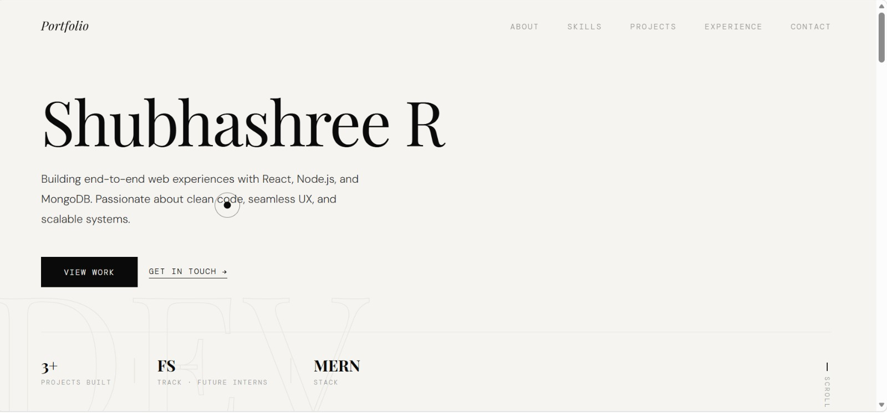
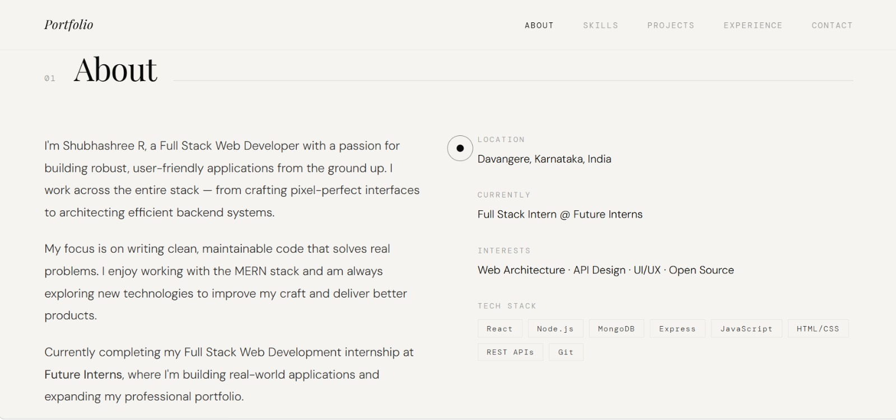

# Portfolio Website

A responsive personal portfolio website built using HTML, CSS, and JavaScript.

## Features
- Home section
- About section
- Projects section
- Contact section

## Technologies Used
- HTML
- CSS
- JavaScript

## Screenshots

## How to Run
1. Download or clone the project.
2. Open `index.html` in your browser.

## Contact
- GitHub: your-username
- Email: your-email@example.com